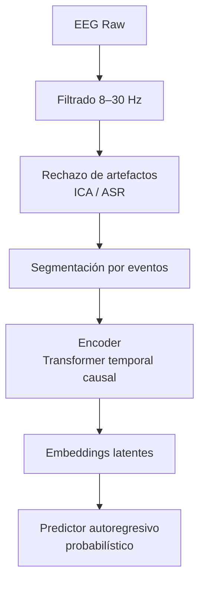

<!-- ========================================================= -->
<!-- Coherencia Predictiva EEG–AGI (CPEA)                     -->
<!-- Versión optimizada para GitHub                           -->
<!-- ========================================================= -->

# 🧠 Coherencia Predictiva EEG–AGI (CPEA)

[](https://github.com/TU-USUARIO/TU-REPO)
[](https://opensource.org/licenses/MIT)
[](https://doi.org/10.5281/zenodo.0000000)
[]()
[]()
[]()

---

> ⚠️ **Estado del Proyecto**  
> Fase 1 — Infraestructura experimental y validación del Índice de Coherencia Predictiva (ICP).

# 📑 Tabla de Contenidos

- [Resumen Ejecutivo](#resumen-ejecutivo)
- [Abstract](#abstract)
- [Palabras Clave](#palabras-clave)
- [1. Introducción](#1-introducción)
- [2. Marco Experimental](#2-marco-experimental)
  - [2.1 Motor Imagery](#21-motor-imagery)
  - [2.2 P300 Visual](#22-p300-visual)
  - [2.3 SSVEP](#23-ssvep)
  - [2.4 Intentos Binarios](#24-intentos-binarios)
- [3. Arquitectura del Pipeline](#3-arquitectura-del-pipeline)
- [4. Índice de Coherencia Predictiva (ICP)](#4-índice-de-coherencia-predictiva-icp)
- [5. Programas de Seguimiento](#5-programas-de-seguimiento)
- [6. Validación Estadística](#6-validación-estadística)
- [7. Reproducibilidad](#7-reproducibilidad)
- [8. Conclusiones](#8-conclusiones)
- [Referencias Comentadas](#referencias-comentadas)

---

# Resumen Ejecutivo

El proyecto **CPEA (Coherencia Predictiva EEG–AGI)** evalúa si un modelo fundacional de inteligencia artificial puede anticipar dinámicas electroencefalográficas humanas bajo paradigmas estructurados.

No se trata de clasificación convencional. El objetivo es cuantificar alineación dinámica mediante un **Índice de Coherencia Predictiva (ICP)** formalizado con teoría de la información.

---

# Abstract

Este trabajo presenta el diseño conceptual y experimental del proyecto CPEA, cuyo objetivo es evaluar la existencia de coherencia predictiva entre dinámicas electroencefalográficas humanas y modelos avanzados de inteligencia artificial. Se emplean paradigmas estructurados —motor imagery, P300, SSVEP e intentos binarios— con el fin de reducir entropía cognitiva y maximizar potencia estadística. Se introduce el Índice de Coherencia Predictiva (ICP), definido mediante divergencia informacional y estimación de información mutua. El estudio integra neurodinámica oscilatoria, modelado temporal profundo y validación estadística robusta.

---

# Palabras Clave

Electroencefalografía, AGI, coherencia predictiva, teoría de la información, BCI, dinámica no lineal, modelado temporal.

---

# 1. Introducción

El EEG representa la manifestación macroscópica de sincronización neuronal distribuida.

El objetivo de CPEA no es decodificar estados mentales aislados, sino evaluar si un sistema artificial puede modelar la dinámica latente cortical con capacidad predictiva superior al azar.

El diseño experimental se fundamenta en paradigmas estructurados que permiten delimitación temporal precisa y control estadístico riguroso.

---

# 2. Marco Experimental

## 2.1 Motor Imagery

- Desincronización en banda mu (8–12 Hz)
- Modulación beta (13–30 Hz)
- Lateralización C3/C4

**Ventaja principal:** alta reproducibilidad intra-sujeto.

## 2.2 P300 Visual

Paradigma oddball con:

- Latencia aproximada de 300 ms
- Activación parietal
- Alta relación señal-ruido

Permite modelado temporal milisegundo a milisegundo.

## 2.3 SSVEP

Estimulación visual periódica que genera:

- Respuesta espectral exacta en frecuencia estímulo
- Alta robustez inter-sujeto
- Excelente coherencia de fase

## 2.4 Intentos Binarios

Paradigma decisional simple (Sí/No) con:

- Activación frontal medial
- Modulación theta

Permite modelado lógico de estados discretos.

---

# 3. Arquitectura del Pipeline



---

# 4. Índice de Coherencia Predictiva (ICP)

**Definición básica**

ICP = I(Xₜ; Y_{t+Δ}) − I(Xₜ; Y_{perm})

Donde:  
- I = Información mutua  
- Y_{perm} = Control por permutación

**Formulación generalizada**

ICP_G = D_KL( P(X_{t+Δ} | X_{≤t}) ‖ P(X_{t+Δ} | Z_t) )

**Interpretación:**

- ICP ≈ 0 → divergencia mínima  
- ICP significativamente positivo → coherencia predictiva real

---

# 5. Programas de Seguimiento

### 5.1 Seguimiento Longitudinal

- 10 sesiones por sujeto  
- Evaluación de estabilidad del ICP  
- Análisis de coadaptación humano–modelo

### 5.2 Seguimiento de Fase

Cálculo de Phase Locking Value:

PLV = | (1/N) ∑ e^{i(ϕ₁ - ϕ₂)} |

Comparación entre señal real y predicha.

### 5.3 Seguimiento de Entropía Multiescala

Cálculo de MSE (Multiscale Entropy).  
Evaluación de convergencia estructural.

---

# 6. Validación Estadística

- 1000 permutaciones por sujeto  
- Bootstrap del ICP  
- Control de dependencia serial  
- Cross-validation bloqueada

**Criterio de significancia:**  
ICP_real > μ_perm + 3σ_perm

---

# 7. Reproducibilidad

### Notebooks recomendados

- Preprocessing Pipeline  
- ICP Computation  
- Statistical Validation  

### Entorno

```bash
conda create -n cpea python=3.10
conda activate cpea
pip install torch numpy scipy mne scikit-learn matplotlib seaborn pandas
```

**Nota técnica importante**  
Todos los experimentos deben incluir control por permutación temporal estratificada para evitar inflación de falsos positivos.

---

# 8. Conclusiones

- Las tareas estructuradas maximizan potencia estadística  
- El ICP formaliza alineación dinámica  
- El EEG debe modelarse como sistema no lineal cercano a criticidad  
- La validación requiere permutaciones robustas  
- El pipeline es replicable y formalizable

---

# Referencias Comentadas

<details>
<summary><strong>Freeman, W.J.</strong> — Dinámica no lineal cortical</summary>

Investigaciones sobre atractores dinámicos en EEG. Fundamentales para comprender transiciones críticas en actividad neuronal.  
DOI: [10.1016/S0306-4522(00)00073-0](https://doi.org/10.1016/S0306-4522(00)00073-0)
</details>

<details>
<summary><strong>Birbaumer, N.</strong> — Entrenamiento de ritmos sensorimotores</summary>

Demostró control voluntario de ritmos mu y beta en BCI.  
DOI: [10.1016/S1388-2457(99)00136-1](https://doi.org/10.1016/S1388-2457(99)00136-1)
</details>

<details>
<summary><strong>Farwell & Donchin</strong> — P300 BCI</summary>

Fundamento del paradigma P300 para interfaces cerebro-computadora.  
DOI: [10.1016/0013-4694(88)90174-5](https://doi.org/10.1016/0013-4694(88)90174-5)
</details>

<details>
<summary><strong>Kraskov et al. (2004)</strong> — Estimación de Información Mutua</summary>

Método k-NN para estimar información mutua en variables continuas.  
DOI: [10.1103/PhysRevE.69.066138](https://doi.org/10.1103/PhysRevE.69.066138)
</details>

---

## 📘 Licencia

MIT License

Proyecto CPEA — Infraestructura Experimental para Evaluación de Coherencia Predictiva EEG–AGI.

```bibtex
@misc{CPEA2026,
  author       = GPT - GROK
  title        = {Coherencia Predictiva EEG–AGI (CPEA)},
  year         = {2026},
  howpublished = {GitHub repository},
  url          = {https://github.com/TU-USUARIO/TU-REPO},
  note         = {Preprint / Experimental infrastructure},
  doi          = {10.5281/zenodo.0000000}
}
```

