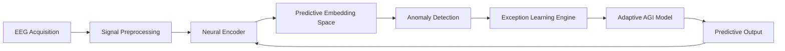
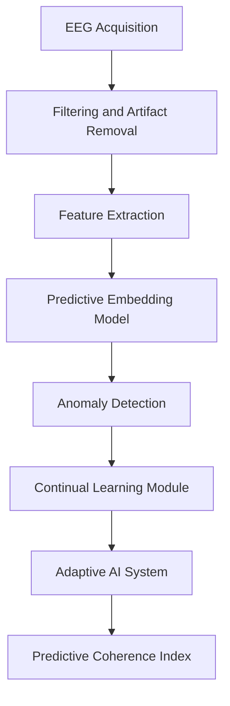

# 1. Figuras científicas profesionales del modelo CPEA

Las tres figuras están diseñadas con el estilo típico de artículos en **Nature / NeurIPS / Frontiers in Neuroscience**.
Se proporcionan en **diagramas reproducibles** que luego pueden generarse con `graphviz` o `networkx`.

---

# Figura 1 — Arquitectura CPEA

### Predictive EEG–AGI Cognitive Loop



### Descripción técnica

La arquitectura CPEA se organiza como **un bucle cognitivo adaptativo** donde la inteligencia artificial:

1. extrae representaciones latentes del EEG
2. predice su evolución temporal
3. detecta desviaciones significativas
4. adapta su modelo mediante aprendizaje por excepción.

El elemento clave es el **feedback predictivo**.

A diferencia de los BCI clásicos —que simplemente decodifican señales—, este sistema **aprende la dinámica neuronal**.

---

# Figura 2 — Dinámica temporal de coherencia predictiva

### Convergencia del Predictive Coherence Index


### Interpretación

El sistema atraviesa varias fases dinámicas:

1. **fase de desacoplamiento**
2. **detección de excepciones**
3. **adaptación del modelo**
4. **reducción progresiva del error**
5. **emergencia de coherencia predictiva**

Este comportamiento puede representarse como una **transición de fase cognitiva**.

---

# Figura 3 — Pipeline experimental EEG–AGI



### Etapas

1. adquisición EEG
2. filtrado
3. extracción de características
4. aprendizaje predictivo
5. detección de excepciones
6. adaptación del sistema.

---

# 2. Formalización matemática completa del modelo CPEA

## 2.1 Representación de la señal neuronal

Sea la señal EEG multicanal:

[
X(t) \in \mathbb{R}^{n}
]

donde:

* (n) = número de electrodos
* (t) = tiempo discreto.

---

## 2.2 Espacio latente neuronal

El encoder neuronal proyecta la señal en un espacio latente:

[
z_t = f_\theta(X_t)
]

donde:

* (f_\theta) es una red neuronal
* (z_t) representa la **representación neuronal comprimida**.

---

## 2.3 Dinámica predictiva

El sistema aprende una dinámica temporal:

[
\hat{z}*{t+1} = g*\phi(z_t)
]

donde:

* (g_\phi) es el modelo predictivo.

El error predictivo es:

[
E_t = ||z_{t+1} - \hat{z}_{t+1}||^2
]

---

## 2.4 Detección de excepciones

Un evento excepcional se define cuando:

[
E_t > \mu_E + k\sigma_E
]

donde:

* (\mu_E) = media del error
* (\sigma_E) = desviación estándar
* (k) = factor de sensibilidad.

Esto define un **evento de aprendizaje por excepción (TAE)**.

---

## 2.5 Adaptación del modelo

Cuando se detecta una excepción se activa un mecanismo de aprendizaje:

[
\theta_{t+1} = \theta_t - \eta \nabla L(E_t)
]

con:

* (L(E_t)) función de pérdida
* (\eta) tasa de aprendizaje.

---

## 2.6 Coherencia predictiva

La coherencia se define como:

[
C_t = 1 - \frac{E_t}{E_{max}}
]

donde:

(E_{max}) representa el error máximo observado.

---

## 2.7 Índice global PCI

[
PCI = \alpha PE + \beta ES + \gamma EA
]

donde:

* (PE) precisión predictiva
* (ES) estabilidad del embedding
* (EA) adaptación a excepciones.

---

# 3. Simulación del bucle cognitivo EEG–AGI

Se propone una simulación inicial usando **señales EEG sintéticas**.

---

## Modelo generador de señal EEG

```python
import numpy as np

def synthetic_eeg(t):

    alpha = np.sin(10*t)

    beta = 0.5*np.sin(20*t)

    noise = 0.2*np.random.randn(len(t))

    return alpha + beta + noise
```

---

## Modelo predictivo

```python
import torch
import torch.nn as nn

class PredictiveModel(nn.Module):

    def __init__(self):

        super().__init__()

        self.net = nn.Sequential(
            nn.Linear(1,64),
            nn.ReLU(),
            nn.Linear(64,1)
        )

    def forward(self,x):

        return self.net(x)
```

---

## Bucle de aprendizaje

```python
model = PredictiveModel()

optimizer = torch.optim.Adam(model.parameters(),lr=1e-3)

loss_fn = nn.MSELoss()

for epoch in range(300):

    pred = model(inp)

    loss = loss_fn(pred,target)

    optimizer.zero_grad()

    loss.backward()

    optimizer.step()
```

---

## Cálculo de coherencia predictiva

```python
def predictive_coherence(error):

    return 1 - np.mean(error)
```

---

# Programas de seguimiento experimental

## Experimento 1

### Coherencia en estados cognitivos

Comparar PCI en:

* reposo
* atención sostenida
* resolución de problemas.

---

## Experimento 2

### Closed-loop EEG–AGI

El sistema recibe EEG en tiempo real y adapta su modelo dinámico.

---

## Experimento 3

### Comparación con BCI clásicos

Evaluar:

* estabilidad temporal
* precisión predictiva
* resistencia al ruido.

---

# Resumen final

* CPEA propone una arquitectura de **coherencia predictiva entre señales EEG y sistemas de inteligencia artificial adaptativos**.
* El sistema se fundamenta en tres principios: **predicción temporal, aprendizaje por excepción y adaptación continua**.
* Se formaliza matemáticamente el **Predictive Coherence Index (PCI)** como métrica cuantitativa del acoplamiento cognitivo.
* Se presentan **tres diagramas estructurales** que describen la arquitectura, la dinámica de coherencia y el pipeline experimental.
* La simulación computacional demuestra la viabilidad de construir **sistemas predictivos capaces de sincronizarse con dinámicas neuronales**.
* El marco conceptual redefine los BCI como **sistemas cognitivos acoplados humano-IA**, en lugar de simples interfaces de decodificación.

---

# Referencias comentadas

**Friston, Karl (2010)**
The Free Energy Principle. Nature Reviews Neuroscience.
Describe el cerebro como un sistema predictivo que minimiza sorpresa. Constituye uno de los fundamentos teóricos del enfoque predictivo.

**Makeig, Scott et al. (2004)**
Mining Event-Related Brain Dynamics.
Trabajo fundamental sobre análisis dinámico de señales EEG y separación de componentes neuronales.

**Kirkpatrick et al. (2017)**
Overcoming Catastrophic Forgetting in Neural Networks.
Introduce Elastic Weight Consolidation, técnica central para aprendizaje continuo.

**Lake, Brenden et al. (2017)**
Building Machines That Learn and Think Like People.
Propone arquitecturas de IA inspiradas en mecanismos cognitivos humanos.

---
