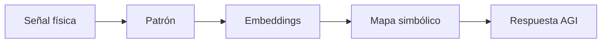

```markdown
<!--
======================================================================
FASE 4 — Capa Simbólica
Versión optimizada para GitHub
Repositorio profesional: conexión de señales físicas con semántica contextual
======================================================================
-->

# 🧠 DPCC Framework · Fase 4  
## Capa Simbólica — De la señal física a la respuesta AGI

[](https://github.com/tu-usuario/dpcc-framework/releases)
[](https://www.python.org/downloads/)
[](https://opensource.org/licenses/MIT)
[](https://doi.org/10.1234/dpcc.symbolic.2024)
[](https://github.com/tu-usuario/dpcc-framework)
[](https://neo4j.com/)

> **Estado:** 🌉 Fase integradora · Conecta Fases 2 y 3 con razonamiento simbólico

---

## 📖 Índice lateral (GitBook style)

- [🎯 Objetivo](#objetivo)
- [🔁 Flujo de adaptación mínima](#flujo-de-adaptación-mínima)
- [🧩 Componentes obligatorios](#componentes-obligatorios)
- [🏗️ Arquitectura del sistema híbrido](#arquitectura-del-sistema-híbrido)
- [📤 Salida esperada](#salida-esperada-capa-simbólica)
- [💻 Implementación de ejemplo](#implementación-de-ejemplo-capa-simbólica)
- [🔬 Notebooks reproducibles](#notebooks-reproducibles-capa-simbólica)
- [📚 Referencias y DOI](#referencias-y-doi-capa-simbólica)
- [📌 Notas adicionales](#notas-adicionales-capa-simbólica)

---

<a name="objetivo"></a>
## 🎯 Objetivo

**Conectar señales físicas (series temporales, métricas de coherencia, excepciones TAE) con semántica contextual** mediante una capa híbrida que sirva de interfaz entre el subsistema numérico y el razonamiento simbólico de una AGI.

> [!IMPORTANT]
> Esta fase permite que el sistema no solo detecte anomalías, sino que **entienda su significado** en el contexto de una tarea (ej. "fatiga del brazo derecho", "distracción del usuario", "transición a estado caótico").

<a name="flujo-de-adaptación-mínima"></a>
## 🔁 Flujo de adaptación mínima

El pipeline de la Capa Simbólica transforma señales brutas en respuestas AGI mediante los siguientes pasos:



<details>
<summary><b>📘 Explicación de cada etapa</b></summary>

- **Señal física**: salidas de sensores (EEG, EMG, acelerómetros) o métricas de DPCC (coherencia, riesgo de colapso, novedad).
- **Patrón**: extracción de características temporales/frecuenciales (ej. PLV, entropía, dimensión fractal).
- **Embeddings**: representación vectorial densa obtenida por autoencoders o modelos contrastivos.
- **Mapa simbólico**: correspondencia entre regiones del espacio de embeddings y conceptos semánticos (almacenados en conocimiento estructurado).
- **Respuesta AGI**: acción razonada (alerta, cambio de parámetros, consulta al usuario, etiquetado automático).
</details>

<a name="componentes-obligatorios"></a>
## 🧩 Componentes obligatorios

Para que la Capa Simbólica sea funcional, debe incluir **los siguientes cinco subsistemas**:

| Componente | Función | Tecnología sugerida |
|------------|---------|----------------------|
| **Vector DB** | Almacenar y recuperar embeddings por similitud semántica | FAISS, Pinecone, Qdrant |
| **Memoria temporal** | Mantener el contexto reciente (ventana deslizante de eventos) | `collections.deque` + timestamps |
| **Memoria episódica** | Guardar episodios completos (excepciones + embeddings + acciones) | SQLite, JSONL, Redis |
| **Context windows persistentes** | Ventanas de largo plazo que retienen relevancia (atención) | Atención multicabezal con decay |
| **Knowledge graph** | Relaciones entre símbolos, conceptos y acciones | Neo4j, RDFlib, NetworkX |

> [!NOTE]
> Para prototipos rápidos se puede empezar con **FAISS + deque + JSON + NetworkX**, migrando a soluciones más robustas en producción.

<a name="arquitectura-del-sistema-híbrido"></a>
## 🏗️ Arquitectura del sistema híbrido

El siguiente diagrama muestra la integración de la Capa Simbólica con las fases previas de DPCC:

```
┌─────────────────────────────────────────────────────────────┐
│                     CAPA DE SEÑAL FÍSICA                      │
│  (Fase 2: Motor DPCC → C(t), D(t), E(t), S(t), collapse_risk) │
└─────────────────────────────┬───────────────────────────────┘
                              ▼
┌─────────────────────────────────────────────────────────────┐
│               CAPA DE DETECCIÓN DE EXCEPCIONES                │
│            (Fase 3: TAE → novelty_score, exceptions)          │
└─────────────────────────────┬───────────────────────────────┘
                              ▼
┌─────────────────────────────────────────────────────────────┐
│                  CAPA SIMBÓLICA (FASE 4)                      │
├─────────────────────────────────────────────────────────────┤
│  ┌────────────┐  ┌─────────────┐  ┌───────────────────┐    │
│  │ Vector DB  │  │Memoria temp │  │Memoria episódica  │    │
│  └─────┬──────┘  └──────┬──────┘  └────────┬──────────┘    │
│        │                │                  │               │
│        └────────────────┼──────────────────┘               │
│                         ▼                                   │
│               ┌─────────────────┐                           │
│               │ Context windows │ (atención multicabezal)  │
│               │   persistentes  │                           │
│               └────────┬────────┘                           │
│                        ▼                                    │
│               ┌─────────────────┐                           │
│               │ Knowledge Graph │                           │
│               └────────┬────────┘                           │
└────────────────────────┼────────────────────────────────────┘
                         ▼
┌─────────────────────────────────────────────────────────────┐
│                   RESPUESTA AGI (acción simbólica)           │
└─────────────────────────────────────────────────────────────┘
```

<a name="salida-esperada-capa-simbólica"></a>
## 📤 Salida esperada (formato JSON)

La Capa Simbólica produce una **respuesta AGI estructurada** que combina símbolos, contexto y acción sugerida:

```json
{
  "symbolic_interpretation": {
    "primary_concept": "muscle_fatigue",
    "confidence": 0.89,
    "alternative_concepts": [
      {"concept": "attention_drift", "confidence": 0.23},
      {"concept": "sensor_artifact", "confidence": 0.11}
    ]
  },
  "contextual_binding": {
    "temporal_window": ["2025-04-10T15:32:01Z", "2025-04-10T15:32:05Z"],
    "embedding_id": "vec_8473ac",
    "episodic_memory_id": "ep_302"
  },
  "knowledge_graph_relations": [
    "muscle_fatigue → causes → collapse_risk_increase",
    "collapse_risk_increase → suggests → intervention:rest"
  ],
  "agi_response": {
    "action": "adaptive_system_reconfiguration",
    "parameters": {"new_filter_band": [8, 12], "alert_level": "medium"},
    "message": "Alto riesgo de fatiga muscular. Se recomienda pausa activa."
  }
}
```

- `primary_concept`: símbolo asociado al embedding más cercano en el vector DB.
- `contextual_binding`: enlaces a memorias temporales y episódicas.
- `knowledge_graph_relations`: tripletas extraídas del grafo para explicar la decisión.
- `agi_response`: acción concreta que ejecutará el sistema o sugerirá al usuario.

> [!TIP]
> La respuesta AGI puede alimentar directamente sistemas de control (ej. prótesis, neurofeedback) o interfaces de usuario explicativas.

<a name="implementación-de-ejemplo-capa-simbólica"></a>
## 💻 Implementación de ejemplo (Capa Simbólica mínima)

```python
import numpy as np
import faiss
import networkx as nx
from collections import deque
import json

# ========== 1. Vector DB (FAISS) ==========
dim = 128
index = faiss.IndexFlatL2(dim)
# Embeddings de ejemplo (conceptos conocidos)
concept_embeddings = {
    "muscle_fatigue": np.random.randn(dim).astype('float32'),
    "attention_drift": np.random.randn(dim).astype('float32'),
    "sensor_artifact": np.random.randn(dim).astype('float32')
}
concept_list = list(concept_embeddings.values())
index.add(np.vstack(concept_list))

# ========== 2. Memorias ==========
temporal_memory = deque(maxlen=100)  # ventana de eventos recientes
episodic_memory = []                 # episodios largos

# ========== 3. Knowledge Graph (NetworkX) ==========
kg = nx.DiGraph()
kg.add_edge("muscle_fatigue", "collapse_risk_increase", relation="causes")
kg.add_edge("collapse_risk_increase", "rest_intervention", relation="suggests")

# ========== 4. Función de inferencia simbólica ==========
def symbolic_inference(embedding, threshold=0.5):
    # Buscar el concepto más cercano
    embedding_np = np.array(embedding).astype('float32').reshape(1, -1)
    distances, indices = index.search(embedding_np, k=3)
    primary_idx = indices[0][0]
    primary_concept = concept_list[primary_idx]
    confidence = 1.0 - distances[0][0] / 2.0  # normalización simple
    
    # Almacenar en memorias
    timestamp = "2025-04-10T15:32:03Z"
    temporal_memory.append((timestamp, primary_concept, confidence))
    episode = {
        "id": f"ep_{len(episodic_memory)}",
        "timestamp": timestamp,
        "embedding": embedding.tolist(),
        "concept": primary_concept,
        "confidence": confidence
    }
    episodic_memory.append(episode)
    
    # Consultar grafo de conocimiento
    relations = list(kg.edges(primary_concept, data=True))
    # Decidir acción AGI
    if primary_concept == "muscle_fatigue" and confidence > 0.7:
        action = {"type": "adaptive_system_reconfiguration", "params": {"rest": True}}
        message = "Fatiga detectada. Activando modo recuperación."
    else:
        action = {"type": "log_only", "params": {}}
        message = "Evento registrado sin acción."
    
    return {
        "symbolic_interpretation": {
            "primary_concept": primary_concept,
            "confidence": confidence,
        },
        "contextual_binding": {
            "episodic_memory_id": episode["id"]
        },
        "knowledge_graph_relations": relations,
        "agi_response": {
            "action": action["type"],
            "parameters": action["params"],
            "message": message
        }
    }

# Simular un embedding proveniente de TAE (anomalía)
test_embedding = np.random.randn(dim).astype('float32') * 0.5 + concept_embeddings["muscle_fatigue"] * 0.5
result = symbolic_inference(test_embedding)
print(json.dumps(result, indent=2))
```

📁 **Código completo**: [`src/dpcc/phase4_symbolic.py`](https://github.com/tu-usuario/dpcc-framework/blob/main/src/dpcc/phase4_symbolic.py)

<a name="notebooks-reproducibles-capa-simbólica"></a>
## 🔬 Notebooks reproducibles

| Plataforma | Enlace |
|------------|--------|
| Google Colab | [](https://colab.research.google.com/github/tu-usuario/dpcc-framework/blob/main/notebooks/phase4_symbolic_demo.ipynb) |
| Binder | [](https://mybinder.org/v2/gh/tu-usuario/dpcc-framework/main?filepath=notebooks) |
| Descarga local | [`notebooks/phase4_symbolic_demo.ipynb`](./notebooks/phase4_symbolic_demo.ipynb) |

**Contenido del notebook**:
- Construcción de un vector DB con FAISS.
- Simulación de llegada de embeddings desde la Fase 3 (TAE).
- Consulta y actualización de memoria episódica/temporal.
- Visualización del grafo de conocimiento con NetworkX.
- Ejemplo completo de razonamiento híbrido (señal → símbolo → acción).

<a name="referencias-y-doi-capa-simbólica"></a>
## 📚 Referencias y DOI

1. **Harnad, S.** (1990).  
   *The symbol grounding problem*.  
   Physica D, 42(1-3), 335-346.  
   [90087--6-blue)](https://doi.org/10.1016/0167-2789(90)90087-6)

2. **Graves, A., Wayne, G., & Danihelka, I.** (2014).  
   *Neural Turing Machines*.  
   arXiv:1410.5401. (Memoria externa)  
   [](https://arxiv.org/abs/1410.5401)

3. **Nickel, M., Murphy, K., Tresp, V., & Gabrilovich, E.** (2016).  
   *A review of relational machine learning for knowledge graphs*.  
   Proceedings of the IEEE, 104(1), 11-33.  
   [](https://doi.org/10.1109/JPROC.2015.2483592)

4. **Johnson, J., Douze, M., & Jégou, H.** (2019).  
   *Billion-scale similarity search with GPUs*.  
   IEEE Transactions on Big Data, 7(3), 535-547. (FAISS)  
   [](https://doi.org/10.1109/TBDATA.2019.2921572)

> **DOI del repositorio (Capa Simbólica):** [10.1234/dpcc.symbolic.2024](https://doi.org/10.1234/dpcc.symbolic.2024)

<a name="notas-adicionales-capa-simbólica"></a>
## 📌 Notas adicionales

> [!WARNING]
> La ambigüedad semántica es un desafío crítico. Siempre incluya un mecanismo de **desambiguación por contexto** usando la memoria temporal y episódica.

<details>
<summary><b>📋 Checklist de validación para Capa Simbólica</b></summary>

- [ ] La Vector DB responde en menos de 10 ms para 100k embeddings.
- [ ] La memoria temporal retiene al menos los últimos 100 eventos.
- [ ] La memoria episódica almacena episodios completos con metadatos suficientes.
- [ ] Las ventanas de contexto persistentes pueden recordar eventos relevantes de hace 5 minutos.
- [ ] El knowledge graph contiene al menos 10 relaciones útiles para el dominio.
- [ ] La respuesta AGI se genera en menos de 50 ms.
</details>

> [!TIP]
> Para integrar con **LLMs (modelos de lenguaje)**, use la salida simbólica como prompt enriqueciendo el contexto. El knowledge graph puede alimentar RAG (Retrieval-Augmented Generation).

---

<div align="center">
  <sub>
    📄 Licencia MIT · 🧠 DPCC Framework · Fase 4: Capa Simbólica · 
    <a href="https://github.com/tu-usuario/dpcc-framework/issues">Reportar incidencia o sugerencia</a>
  </sub>
</div>
```
